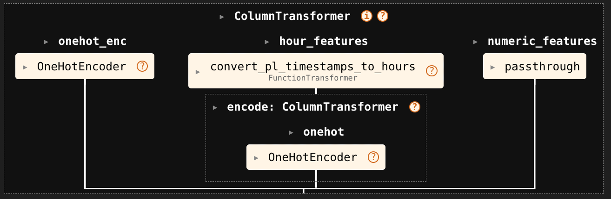
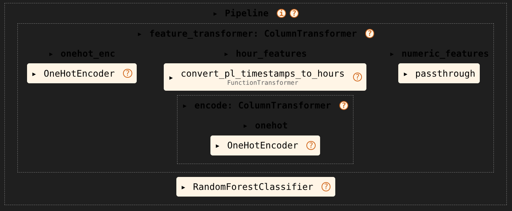

# Network Intrusion Detection

## Introduction
Cyberattacks are escalating at a staggering rate globally. Intrusion prevention systems continuously monitor network traffic, looking for possible malicious incidents, containing the threat and capturing information about them, further reporting such information to system administrators, and improving preventive action. 

With the changing patterns in network behavior, it is necessary to use a dynamic approach to detect and prevent such intrusions. A lot of research has been devoted to this field, and there is a universal acceptance that static datasets frozen in time do not capture traffic compositions and interventions. This brings the need to have an up-to-date, reproducible, and extensible dataset from which to learn behaviors to counter sophisticated attackers who can easily bypass basic intrusion detection systems (IDS), along with an automated machine learning system to learn the necessary patterns from this data.

The goal of this example is to demonstrate how a Network Intrusion Detection model could be built from collected data, using the open-source [scikit-learn*](https://scikit-learn.org) library, and accelerating it with the [Extension for scikit-learn*](https://uxlfoundation.github.io/scikit-learn-intelex) for larger-scale datasets.

## Solution Technical Overview
A network-based intrusion detection system (NIDS) is used to monitor and analyze network traffic to protect a system from network-based threats. A NIDS reads all inbound packets and searches for any suspicious patterns. When threats are discovered, based on their severity, the system could take action such as notifying administrators, or barring the source IP (internet protocol) address from accessing the network.

The experiment aimed to build a Network Intrusion Detection System that detects any network intrusions. The main purpose of a NIDS is to alert a system administrator each time an intruder tries to access into the network using a supervised learning algorithm. The goal is to train a model to classify the input data as benign, malicious, or outlier.

In order to do this, for demonstrative purposes given the size of the dataset, this example uses a single day of data (`2021.01.17.csv`) which contains over a million rows from which many patterns are possible to generalize already, and evaluates the quality of the generated NIDS on the next day of data (`2021.01.18.csv`). In practice, one might want to use more days of data in order to arrive at a better and more generalizable solution, for which computational considerations and efficiency of the libraries become even more important.

## Solution Technical Details
As classification analysis is an exploratory task, an analyst will often run on different datasets of different sizes, resulting in different insights that they may use for decisions all from the same raw dataset. The algorithm used for classification is [Random Forest](https://scikit-learn.org/stable/modules/generated/sklearn.ensemble.RandomForestClassifier.html), embedded into a [feature pipeline](https://scikit-learn.org/stable/modules/generated/sklearn.pipeline.Pipeline.html) which transforms the raw data into features that statistical models like Random Forest can use.

The reference kit implementation is a reference solution to the described use case that includes:

  * An reference End-to-End (E2E) architecture for building the NIDS model with stock scikit-learn*
  - An optimized E2E architecture speeding up the model fitting and prediction times with Extension for scikit-learn*

### Expected Input-Output

**Input**                                 | **Output** |
| :---: | :---: |
| Telemetry data records          | For each type of intrusion (malignant, benign, outlier) $d$, the probability [0, 1] of the intrusion $d$ |

**Example Input**                                 | **Example Output** |
| :---: | :---: |
|Values for avg_ipt, bytes_in, bytes_out, dest_ip, dest_port, entropy, num_pkts_out, num_pkts_in, proto, src_ip,    src_port,    time_end,    time_start,    total_entropy, label,    duration | {'Malignant': 0.778, 'Benign': 0.023, 'Outlier': 0.176}

### Dataset

This reference kit uses the LUFlow dataset available at Kaggle*, which can be found at https://www.kaggle.com/datasets/mryanm/luflow-network-intrusion-detection-data-set (2021.01.17.csv file is downloaded and saved to the data folder and used as a dataset in this reference kit). 

LUFlow is a flow-based intrusion detection data set which contains telemetry of emerging attacks. Flows which were unable to be determined as malicious but are not part of the normal telemetry profile are labelled as outliers.

Each row in the data set has values for:

| Name | Description |
| --- | --- |
| src_ip | The source IP address associated with the flow. This feature is anonymised to the corresponding Autonomous System |
| src_port | The source port number associated with the flow. |
| dest_ip | The destination IP address associated with the flow. The feature is also anonymised in the same manner as before.
| dest_port | The destination port number associated with the flow |
| protocol | The protocol number associated with the flow. For example TCP is 6 |
| bytes_in | The number of bytes transmitted from source to destination |
| bytes_out | The number of bytes transmitted from destination to source. |
| num_pkts_in | The packet count from source to destination |
| num_pkts_out | The packet count from destination to source |
| entropy | The entropy in bits per byte of the data fields within the flow. This number ranges from 0 to 8. |
| total_entropy | The total entropy in bytes over all of the bytes in the data fields of the flow |
| avg_ipt | The mean of the inter-packet arrival times of the flow |
| time_start | The start time of the flow in seconds since the epoch. |
| time_end | The end time of the flow in seconds since the epoch |
| duration | The flow duration time, with microsecond precision |
| label | The label of the flow, as decided by Tangerine. Either benign, outlier, or malicious |

Based on these features, the Network Intrusion Detection System has been built to identify the type of access (the 'label' column). Instructions for downloading the data can be found in the [Download the Dataset](#download-the-dataset) section.

> *Please see this data set's applicable license for terms and conditions. Intel® Corporation does not own the rights to this data set and does not confer any rights to it.*

## How it Works
As mentioned above, this Network Intrusion Detection System uses a Random Forest algorithm from the scikit-Learn* library to train a machine learning model which can classify instances (network traffic) into the desired labels "benign', 'outlier', or 'malicious'.

The use-case involves teh following steps:
* Reading the data.
* Feature engineering.
* Model fitting.
* Model evaluation.
* Hyperparameter tuning.

## Geting Started
To follow this example, it is necessary to set up a Python environment with the necessary dependencies, along with downloading the data and the source code of this example.

### Download the Refence Kit Repository
As a first step, this repository can be cloned with `git`, by executing the following command on a terminal:

```shell
git clone https://github.com/oneapi-src/network-intrusion-detection.git
cd network-intrusion-detection
```

### Set up the Software Environment

To run this reference kit, a Python installation with the libraries specified in [requirements.txt](requirements.txt) is needed. A conda environment with these requirements is also specified in file [environment.yaml](environment.yaml) for ease of installation.

To set up the required Python environment with the necessary dependencies, it is recommended to create a virtual environment and then install them with `pip` - for example, assuming a Linux* environment with `python` already installed on it:

```shell
python -m venv network_intrusion
source network_intrusion/bin/activate
pip install requirements.txt
```

Alternatively, the environment can be set up through conda ([miniforge](https://github.com/conda-forge/miniforge) distribution is highly recommended) as follows:

```shell
conda env create --file=environment.yaml
conda activate network_intrusion
```

### Download the Dataset
The data for this example can be downloaded from this [Kaggle* link](https://www.kaggle.com/datasets/mryanm/luflow-network-intrusion-detection-data-set) in different ways. As a first step, you might need to register an account if you do not have one already.

Then, download the data from the 'Download' button at the top-left of this page, and place it under the root folder of the repository with this example:
https://www.kaggle.com/datasets/mryanm/luflow-network-intrusion-detection-data-set

Alternatively, the data can be downloaded from a terminal after [setting up a Kaggle* API configuration](https://github.com/Kaggle/kaggle-api), for example by creating a file `~/.kaggle/kaggle.json` containing the necessary credentials. Assuming a Linux* environment where the credentials are set up, the following command should download the data:

```shell
curl -L -o luflow-network-intrusion-detection-data-set.zip \
    https://www.kaggle.com/api/v1/datasets/download/mryanm/luflow-network-intrusion-detection-data-set
```

After downloading the data, it is necessary to extract the files from the target days of data from the archive and put them under the folder `data/` at the root of this repository as follows, assuming that the command is executed from the root of the cloned repository:

```shell
mkdir -p data
unzip -p luflow-network-intrusion-detection-data-set.zip "2021/01/2021.01.17/2021.01.17.csv" > data/2021.01.17.csv
unzip -p luflow-network-intrusion-detection-data-set.zip "2021/01/2021.01.18/2021.01.18.csv" > data/2021.01.18.csv
```

## Reference Implementation

In this section, we describe the process of building the reference solution using the scripts that we have provided, assuming that these scripts are being executed from the root of the git repository that was cloned earlier.

To run this worklow, one can execute each of the scripts under `src/` in sequential order:
```shell
python src/run_training.py
python src/run_evaluation.py
python src/run_hyperparameter_tuning.py
```

Or, to execute the optimized versions:
```shell
python src/run_training.py --sklearnex=1
python src/run_evaluation.py
python src/run_hyperparameter_tuning.py --sklearnex=1
```

**Note:** the provided reference implementation with default arguments is meant to be executed on server-grade hardware, and as such, requires a **minimum** of 64GB of RAM to execute with optimizations enabled (``sklearnex=1``), and a minimum of 340GB of RAM to execute without the optimizations enabled (default mode).

The timings in this example were measured on an Intel® Xeon 6767P server using 64 cores.

For consumer-grade hardware, an option ``subsample=1`` is also accepted by the scripts `run_training.py` and `run_hyperparameter_tuning.py` - this option will subsample the data to 15,000 randomly selected rows, resulting in a much smaller problem that can be executed with 8GB of RAM. Be aware that the subsampled example will produce solutions of a lesser quality, and might not be able to fully reflect all the optimizations due to the small input sizes.

This section breaks down all the steps that happen in the example code. See the files under `src/` for the source code with the solution - main file is [run_training.py](src/run_training.py).

### Feature Engineering

Models like Random Forests require data to be represented through features that reflect measurements across different relevant aspects of the observations. For example, the data has connection ports, which are integer numbers, but unlike a feature like 'bytes', connection ports do not have an inherent hierarchy - that is, port '81' does not measure more of something than port '80'. As such, many of the columns in the data need to first be converted into something that a statistical model can use, which is done through a [transformer pipeline](https://scikit-learn.org/stable/modules/compose.html) in the scikit-learn* ecosystem.

In this example, columns such as connection ports will be treated as categorical variables, from which the most common categories (e.g. the ports most frequently used to connect) will be used as binarized features through [one-hot encoding](https://en.wikipedia.org/wiki/One-hot), while uncommon categories will be grouped together into a single 'infrequent' group. Note that, unlike other families of machine learning models, decision-tree-based models like Random Forests might not achieve their best performance when data has too many columns with little variance, hence the 'infrequent' grouping which is built-in in scikit-learn* transformers.

Timestamps in the data, unlike ports, are a quantitative measurement of a dimension (time), but since the goal behind the model is to generalize patterns to data in the future (with timestamps outside of the training data), it is not advantageous to use 'time' in such a way that learnt patterns from it would only apply to past data. As such, this example instead extracts the hour of the day from the timestamps, and treats it as an unordered categorical variable, from which one-hot encoded features are derived in the same way as for ports.

Many other potential transformations of the data are useful for machine learning algorithms - for example, joint variables representing a combination of input port and destination port might also be helpful - and in practice, one might want to experiment with different features and select only the most promising ones, but for simplicity purposes, this example will stop at these very basic features.

In scikit-learn*, feature engineering can either be performed as an independent step, or can be combined together with model training into a pipeline, which enforces all the feature transformations to happen before a model is fed any data. Since the model here requires this feature engineering to work, the example uses the pipeline approach. See the next section for how to execute this step.



### Model Building

The machine learning model used here is a Random Forest classifier, which is an ensemble of many [decision trees](https://en.wikipedia.org/wiki/Decision_tree) where each tree tries to devise simple rules of the kind 'if feature X is less than Y and feature W is greater than Z, then predict A, otherwise predict B' to classify observations into labels, with each tree using different random subsamples of the data and their results being averaged at the end in order to make a final prediction.

Typically, Random Forest models learn a very large amount of rules by assigning the data into groups, and then subdividing each group further and further until there are few observations on it through more decision rules. However, for datasets with millions of observations, it is advantageous to limit the maximum depth to which these divisions can go, both to shorten the computational workloads towards reasonable durations, and to improve their generalization ability towards new data - i.e. to combat [overfitting](https://en.wikipedia.org/wiki/Overfitting). In this example, the depths of the models are constrained to a maximum of 4 recursive partitions per decision tree, while an unconstrained model may otherwise go to hundreds or more. Likewise, the number of decision trees averaged in the forest ensemble is increased from the default of 100 to 1,000, in order to ensure that their averages converge - as the data sizes grow larger, even more decision trees might be required for good results.

Building a machine learning model with scikit-learn* is as simple as instantiating a model object with the desired parameters such as maximum depth (`model = RandomForestClassifier(max_depth=4)`), and calling the method `model.fit(X, y)` by passing it the earlier data (`X` being the features, and `y` being label). Models can be fitted on their own or can be embedded as the last step of a pipeline, where the data will first be processed by the previous steps in the pipeline before feeding it into the model - in this example, the model fitting will be incorporated as the last step of the feature pipeline, which further simplifies future predictions and model evaluation.



To run both the feature engineering and model building steps, execute the script [run_traing.py](src/run_training.py) under the `src/` folder:
```shell
python src/run_training.py
```

Full usage description for this script:
```
usage: run_training.py [-h] [--data_file DATA_FILE] [--output_file OUTPUT_FILE]
                       [--subsample SUBSAMPLE] [--sklearnex SKLEARNEX]

options:
  -h, --help            show this help message and exit
  --data_file DATA_FILE
                        Path to the input CSV data file for day 2021-01-17.
  --output_file OUTPUT_FILE
                        Path where to save the resulting model pipeline.
  --subsample SUBSAMPLE
                        Whether to sub-sample the data for low-RAM setups.
  --sklearnex SKLEARNEX
                        Whether to use the Extension for scikit-learn or not.
```

Example output that might be observed:
```
INFO:root:Start of NIDS model training
INFO:root:      Input data file: data/2021.01.17.csv
INFO:root:      Using optimized Extension: False
INFO:root:      Training data has: 1284403 rows
INFO:root:Now fitting the model pipeline...
INFO:root:Model and transformers fitting took 42.9248833656311 seconds.
INFO:root:Saving model pipeline to file: saved_models/reference_model_pipeline.pkl
```

### Predicting on new data

The decision rules learnt from Random Forests can then be applied to new incoming data after calculating all the necessary engineered features, for which the labels (benign, outlier, malicious) are not known apriori.

These learnt rules will tell the estimated probability of each new observation (network connection) belonging to one of the known classes: benign, outlier, or malicious. Incoming connections whose probability of being malicious is high are good candidates for taking automated action, such as blocking connections, or reporting them to a system administrator.

Scikit-learn* pipelines allow easily making predictions on new incoming data - calling `model_pipeline.predict_proba(X_new)` will first calculate all the features through the transformers in the pipelines, and will then pass those to the fitted model to get the predicted probabilities.

### Evaluating model quality

One might wonder how reliable are the predictions of the model - i.e. how well do the predicted probabilities compare against the true labels.

Usually, models in machine learning are evaluated in their ability to generalize to new data as opposed to how well they predict the data they were initially fed, for which it is imperative to leave a hold-out sample of the data for evaluation purposes only - this hold-out data should *not* be used to build the model itself, only to evaluate it.

In our example, the model was fed a single day of data, and there are many other days with millions of observations each in the dataset. Hence, a reasonable approach here is to evaluate the model on data from a different day. For this purpose, the whole next day of data will be used in the example.

When it comes to classification problems, a logical and common way to evaluate the quality of the results is through classification accuracy - meaning: for each observation, the most probable class (with the highest predicted probability) is taken as the model prediction, and the percentage of predictions that match against the real label is then calculated as the classification accuracy. This metric is not always the most desirable - for example, if 90% of the observations belonged to the same class, a classifier that always predicts that class would already achieve 90% accuracy, but would not be useful in practice - and one might oftentimes also want to look at other metrics or at a [confusion matrix](https://en.wikipedia.org/wiki/Confusion_matrix), which tabulates the cross-frequencies of each real-predicted label possibilities.

To run model evaluation from the model pipeline produced in the earlier step, execute the script [run_evaluation.py](src/run_evaluation.py) as follows:
```shell
python src/run_evaluation.py
```

Full usage description:
```
usage: run_evaluation.py [-h] [--data_file DATA_FILE] [--model_file MODEL_FILE]

options:
  -h, --help            show this help message and exit
  --data_file DATA_FILE
                        Path to the input CSV data file for day 2021-01-18.
  --model_file MODEL_FILE
                        Path to the saved model pipeline produced by 'run_training.py'.
```

The script will print the accuracy metric along with a confusion matrix. Example output:

```
INFO:root:Evaluating model quality
INFO:root:Evaluation data file: data/2021.01.18.csv
INFO:root:Saved model file: saved_models/reference_model_pipeline.pkl
INFO:root:Calcualting model predictions...
INFO:root:      Time to predict: 7.2297279834747314
INFO:root:Classification accuracy: 79.06%
INFO:root:Confusion matrix:
INFO:root:shape: (3, 4)
┌─────────────────┬────────────────────┬──────────────────┬────────────┐
│ Predict: benign ┆ Predict: malicious ┆ Predict: outlier ┆ True class │
│ ---             ┆ ---                ┆ ---              ┆ ---        │
│ i64             ┆ i64                ┆ i64              ┆ str        │
╞═════════════════╪════════════════════╪══════════════════╪════════════╡
│ 460657          ┆ 26                 ┆ 0                ┆ benign     │
│ 21417           ┆ 292654             ┆ 0                ┆ malicious  │
│ 7667            ┆ 170390             ┆ 0                ┆ outlier    │
└─────────────────┴────────────────────┴──────────────────┴────────────┘
```

In this example, one can verify from the confusion matrix that the model is learning something valid from the data and is able to generalize these rules to classify to new data, albeit imperfectly - for example, it never predicts the 'outlier' class as the most probable for observations in this new day of data.

The accuracy (79%) is also a reasonable number that's higher than simple rules such as always predicting the most common class (benign), which in this case accounts for 64% of the observations in the training data, and 48% of the observations in the evaluation data.

## Optimized Implementation

#### <a name="use-case-flow"></a>Optimized E2E architecture


Fitting and evaluating machine learning models can be a slow and computationally demanding process, especially as data sizes grow. Oftentimes, when it comes to scaling models to larger datasets, the first instinct for many practicioners is to employ larger hardware - e.g. more CPU cores, more RAM - but in many cases, substantial performance improvements can be unlocked for free through software improvements.

On Intel® CPUs, workloads from scikit-learn* can be easily accelerated with minimal changes in source code using the [Extension for scikit-learn*](https://uxlfoundation.github.io/scikit-learn-intelex), which is designed to fully exploit all the capabilities offered by Intel® hardware, enabling better scalability, faster experimentation, and running more experiments within the same time window.

Using the Extension for scikit-learn* in an existing scikit-learn* workflow is as easy as adding these two lines of code at the top of a given `.py` file:
```python
from sklearnex import patch_sklearn
patch_sklearn()
```

The `run_training.py` script in this example accepts an argument `--sklearnex=1` which will turn on the optimizations enabled by the Extension for scikit-learn*. As can be seen, this results in a substantial performance improvement without compromising on model quality:

```shell
python src/run_training.py --sklearnex=1
```

```
Extension for Scikit-learn* enabled (https://github.com/uxlfoundation/scikit-learn-intelex)
INFO:root:Start of NIDS model training
INFO:root:      Input data file: data/2021.01.17.csv
INFO:root:      Using optimized Extension: True
INFO:root:      Training data has: 1284403 rows
INFO:root:Now fitting the model pipeline...
INFO:sklearnex: sklearn.ensemble.RandomForestClassifier.fit: running accelerated version on CPU
INFO:sklearnex:sklearn.ensemble.RandomForestClassifier.fit: running accelerated version on CPU
INFO:root:Model and transformers fitting took 8.561280250549316 seconds.
INFO:root:Saving model pipeline to file: saved_models/reference_model_pipeline.pkl
```

Enabling the optimizations from the Extension from scikit-learn reduced the model fitting time from 43 seconds to 8.6 seconds (a **5x** performance improvement). To evaluate the results from this optimized model, execute the `run_evaluation.py` script again:
```shell
python src/run_evaluation.py
```

```
INFO:root:Evaluating model quality
INFO:root:Evaluation data file: data/2021.01.18.csv
INFO:root:Saved model file: saved_models/reference_model_pipeline.pkl
INFO:root:Calcualting model predictions...
INFO:sklearnex: sklearn.ensemble.RandomForestClassifier.predict: running accelerated version on CPU
INFO:sklearnex:sklearn.ensemble.RandomForestClassifier.predict: running accelerated version on CPU
INFO:root:      Time to predict: 3.182605028152466
INFO:root:Classification accuracy: 79.29%
INFO:root:Confusion matrix:
INFO:root:shape: (3, 4)
┌─────────────────┬────────────────────┬──────────────────┬────────────┐
│ Predict: benign ┆ Predict: malicious ┆ Predict: outlier ┆ True class │
│ ---             ┆ ---                ┆ ---              ┆ ---        │
│ i64             ┆ i64                ┆ i64              ┆ str        │
╞═════════════════╪════════════════════╪══════════════════╪════════════╡
│ 460651          ┆ 32                 ┆ 0                ┆ benign     │
│ 14060           ┆ 294831             ┆ 5180             ┆ malicious  │
│ 3766            ┆ 174291             ┆ 0                ┆ outlier    │
└─────────────────┴────────────────────┴──────────────────┴────────────┘
```

The Extension for scikit-learn* also reduced the model prediction time from 7.2 seconds to 3.2 seconds (a **2.3x** improvement).

## Tuning hyperparameters

Machine learning algorithms typically offer multiple user-selectable parameters that affect the quality of the generated model, known as [hyperparameters](https://en.wikipedia.org/wiki/Hyperparameter_(machine_learning)). In the previous sections, the maximum depth of the decision trees was capped at 4 in order to accelerate model fitting and predictions and in order to combat overfitting, but there are more hyperparameters that can be modified for a better model - for example, the amount of features that are considered for each splitting rule, the sizes of the data subsamples that each tree works on, the minimum amount of observations in a leaf node, among others.

It is not possible to know apriori which parameters will result in the best possible model. Hence, deciding on the right parameters involves experimenting with different combinations and evaluating their results on new data to then select the best, known as 'hyperparameter tuning'.

Since we would still like to correctly evaluate the end result, in order to tune hyperparameters, the hold-out evaluation set is not used. Instead, data for training and evaluating different hyperparameters is typically simulated from the training data by splitting it into multiple random subsets, then running training on all but one subset, evaluating on the held-out subset, and averaging metrics across all these hold-out subsets. This is known as K-fold [cross-validation](https://scikit-learn.org/stable/modules/cross_validation.html).

After determining the best hyperparameters, the model may then be re-trained on the whole data using the most promising parameters, to then be evaluated on the initial hold-out sample which was not used for tuning.

This experimentation and cross-validation of parameters can be done automatically in the scikit-learn* framework using meta-estimators such as [GridSearchCV](https://scikit-learn.org/stable/modules/generated/sklearn.model_selection.GridSearchCV.html), which can do the entire process after being supplied a given model object or pipeline and the parameters to try out. For this example, we will reuse the earlier pipeline, but will instruct the meta-estimator to try out different hyperparameters for the Random Forest model part of the pipeline - here, we will also try out other maximum depths and different number of features considered for each split. See the documentation for [RandomForestClassifier in scikit-learn*](https://scikit-learn.org/stable/modules/generated/sklearn.ensemble.RandomForestClassifier.html) for more information about these hyperparameters.

Hyperparameter tuning involves repeatedly running model training and predictions, which multiplies the computational workload and increases running times substantially. In many scenarios, the amount of possible experiments to conduct is limited by the available computational capacity or budget, for which the Extension for scikit-learn* becomes more useful as it allows running more experiments in the same amount of time.

To run hyperparameter tuning, execute the script [run_hyperparameter_tuning.py](src/run_hyperparameter_tuning.py):
```shell
python src/run_hyperparameter_tuning.py
```

Full usage description:
```
usage: run_hyperparameter_tuning.py [-h] [--training_data TRAINING_DATA]
                                    [--evaluation_data EVALUATION_DATA] [--model_file MODEL_FILE]
                                    [--output_file OUTPUT_FILE] [--subsample SUBSAMPLE]
                                    [--sklearnex SKLEARNEX]

options:
  -h, --help            show this help message and exit
  --training_data TRAINING_DATA
                        Path to the input CSV data file for day 2021-01-17, from which the model
                        will be trained and tuned.
  --evaluation_data EVALUATION_DATA
                        Path to the input CSV data file for day 2021-01-18, on wich the tuned model
                        will be evaluated.
  --model_file MODEL_FILE
                        Path to the saved model pipeline produced by 'run_training.py'.
  --output_file OUTPUT_FILE
                        Path where to save the resulting model pipeline.
  --subsample SUBSAMPLE
                        Whether to sub-sample the data for low-RAM setups.
  --sklearnex SKLEARNEX
                        Whether to use the Extension for scikit-learn or not.
```

* Example output that this might generate **without** the optimizations enabled by the Extension for scikit-learn*:
```
INFO:root:Start of NIDS model evaluation
INFO:root:      Training data file: data/2021.01.17.csv
INFO:root:      Evaluation data file: data/2021.01.18.csv
INFO:root:      Training data has: 1284403 rows
INFO:root:      Evaluation data has: 952811 rows
INFO:root:Now fitting the tuning pipeline...
INFO:root:Model tunning plus feature transformers took 668.7255980968475 seconds.
INFO:root:Best hyperparameters:
INFO:root:{'max_depth': 6, 'max_features': 'sqrt'}
INFO:root:Calcualting model predictions on hold-out data...
INFO:root:      Time to predict: 6.918071508407593
INFO:root:Classification accuracy: 77.22%
INFO:root:Confusion matrix:
INFO:root:shape: (3, 4)
┌─────────────────┬────────────────────┬──────────────────┬────────────┐
│ Predict: benign ┆ Predict: malicious ┆ Predict: outlier ┆ True class │
│ ---             ┆ ---                ┆ ---              ┆ ---        │
│ i64             ┆ i64                ┆ i64              ┆ str        │
╞═════════════════╪════════════════════╪══════════════════╪════════════╡
│ 460641          ┆ 42                 ┆ 0                ┆ benign     │
│ 26              ┆ 124031             ┆ 190014           ┆ malicious  │
│ 32              ┆ 26901              ┆ 151124           ┆ outlier    │
└─────────────────┴────────────────────┴──────────────────┴────────────┘
INFO:root:Saving tuned pipeline to file: saved_models/tuned_model_pipeline.pkl
```

* Example output that this might generate **with** the optimizations enabled by the Extension for scikit-learn*:
```shell
python src/run_hyperparameter_tuning.py --sklearnex=1
```
```
Extension for Scikit-learn* enabled (https://github.com/uxlfoundation/scikit-learn-intelex)
INFO:root:Start of NIDS model evaluation
INFO:root:      Training data file: data/2021.01.17.csv
INFO:root:      Evaluation data file: data/2021.01.18.csv
INFO:root:      Training data has: 1284403 rows
INFO:root:      Evaluation data has: 952811 rows
INFO:root:Now fitting the tuning pipeline...
INFO:root:Model tunning plus feature transformers took 88.91097116470337 seconds.
INFO:root:Best hyperparameters:
INFO:root:{'max_depth': 6, 'max_features': 'sqrt'}
INFO:root:Calcualting model predictions on hold-out data...
INFO:sklearnex: sklearn.ensemble.RandomForestClassifier.predict: running accelerated version on CPU
INFO:sklearnex:sklearn.ensemble.RandomForestClassifier.predict: running accelerated version on CPU
INFO:root:      Time to predict: 6.309255838394165
INFO:root:Classification accuracy: 77.07%
INFO:root:Confusion matrix:
INFO:root:shape: (3, 4)
┌─────────────────┬────────────────────┬──────────────────┬────────────┐
│ Predict: benign ┆ Predict: malicious ┆ Predict: outlier ┆ True class │
│ ---             ┆ ---                ┆ ---              ┆ ---        │
│ i64             ┆ i64                ┆ i64              ┆ str        │
╞═════════════════╪════════════════════╪══════════════════╪════════════╡
│ 460641          ┆ 42                 ┆ 0                ┆ benign     │
│ 8               ┆ 122457             ┆ 191606           ┆ malicious  │
│ 19              ┆ 26830              ┆ 151208           ┆ outlier    │
└─────────────────┴────────────────────┴──────────────────┴────────────┘
INFO:root:Saving tuned pipeline to file: saved_models/tuned_model_pipeline.pkl
```

In this case, the hyperparameters did not make much of a difference in the final predictions, and the optimal across the assessed parameters was not too different from what was used in the initial training script, but other families of machine learning models might be a lot more sensitive towards the choice of hyperparameters.

Note that the script here did not try out many possible hyperparameters - it's possible that much higher maximum depths could result in better performing models, but be aware that computation times and RAM requirements might grow exponentially with higher depths.

## Summary

Statistical Network Intrusion Detection based on supervised machine learning is an ongoing process where models must be trained and updated with new data to accurately detect behaviors of attackers. In this reference kit, we demonstrated how a supervised machine learning model can be built from collected network data for this purpose and how it can be evaluated based on the same data.

We also showed how to accelerate both the building and serving of these models using optimizations from the Extension for scikit-learn*, and we further introduced the concept of hyperparameter tuning, where computational workloads increase substantially and accelerations become even more noticeable.

## Learn More
For more information about or to read about other relevant workflow examples, see these guides and software resources:

- [scikit-learn*](https://scikit-learn.org)
- [Extension for scikit-learn*](https://www.intel.com/content/www/us/en/developer/tools/oneapi/scikit-learn.html)

## Appendix
\*Names and brands that may be claimed as the property of others. [Trademarks](https://www.intel.com/content/www/us/en/legal/trademarks.html).

### Disclaimers
To the extent that any public or non-Intel datasets or models are referenced by or accessed using tools or code on this site those datasets or models are provided by the third party indicated as the content source. Intel does not create the content and does not warrant its accuracy or quality. By accessing the public content, or using materials trained on or with such content, you agree to the terms associated with that content and that your use complies with the applicable license.

Intel expressly disclaims the accuracy, adequacy, or completeness of any such public content, and is not liable for any errors, omissions, or defects in the content, or for any reliance on the content. Intel is not liable for any liability or damages relating to your use of public content.
